# About

* Laut [wien.gv.at](https://www.wien.gv.at/verkehr/radfahren/radnetz/fakten.html#:~:text=Das%20Radfahren%20ist%20in%20Wien,Radfahrstreifen%3A%2044%2C6%20Kilometer) hat Wien 169,2km Radwege (20.01.2023). 
* Fragestellungen: 
    * zählt Wien Radwege die auf beiden Seiten einer Strasse geführt werden doppelt? (z.B. Einrichtungsradwege auf je einer Strassenseite)
    * Zählt Wien auch lange Freizeitstrecken, insbesondere beide Ufer der Donau und die Donauinsel, als Radwege?
* Methode: Berechnen der Länge der baulich getrennten Radwege anhand der Vektordaten der Stadt Wien; Berechnen der Länge zweiseitiger Radwege; vergleich.

# Ergebnis: 

* Nach den Vektordaten von 20.01.2023 hat Wien <b>172.7 km</b> baulich getrennte Radwege. (lt. Wien 169.2 km)
* Doppelseitig geführte Strassen ca. <b>23.8 km</b>. 
* Gesamtlänge wenn man doppelte Zählung abzieht: 172.7km - 23.8km = <b>148.9 km</b>

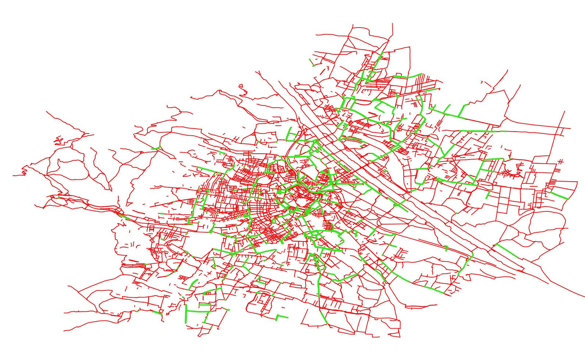

(Grün: Baulich getrennter Radweg; Rot: Alles was die Stadt sonst noch als Radinfrastruktur interpretiert)

# Conclusio

Es scheint als ob die offiziellen Zahlen der Stadt Wien beidseitig geführte Radwege auch doppelt zählen. Die offiziellen zahlen unterscheiden sich allerdings nur um 13.6% von den hier berechneten Werten, die Unterschiede sind also nicht so dramatisch wie ursprünglich erwartet. Insbesondere wurden die Freizeitstrecken entlang der Donau und Donauinsel nicht als Radwege gezählt (da sie keine dedizierten Radwege sind), was die Werte stark inflationär erhöht hätte.

Der Author der Berechnung hat keine Vorerfahrung mit QGIS, etwaige Fehler in der Methode sind nicht ausgeschlossen.

# Berechnen der Streckenlänge

### Radwegsdaten

* WFS GetFeature (SHP)
* https://www.data.gv.at/katalog/dataset/stadt-wien_radfahranlagenwien#resources
* (RADWEGEOGD.zip)

### In QGIS 3.10 öffenen

- QGIS öffnen
- Neues Projekt anlegen
- drag&drop RADWEGEOGDLine.shp

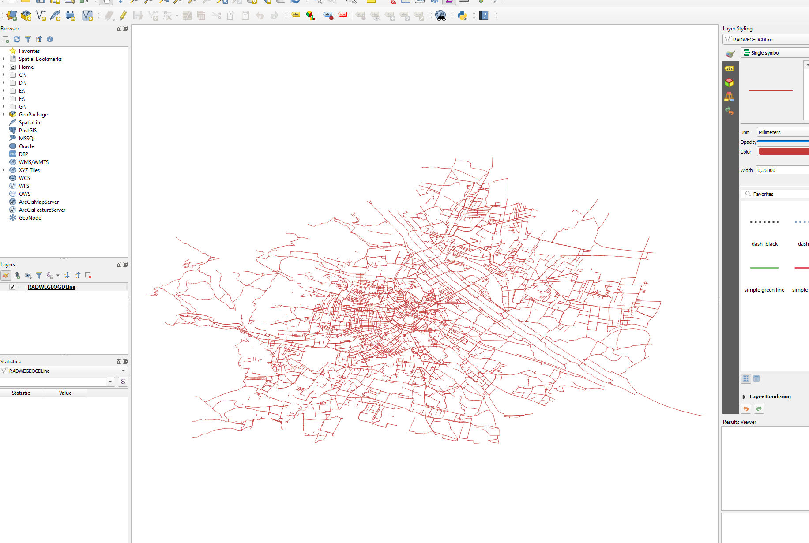

### Baulich Getrennte Radwege markieren

* Attribute Table für alle radinfrastruktur features öffnen

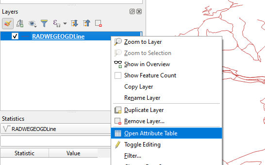

* Features nach SUBMERKMAL = "Baulicher Radweg" filtern
* Mit "Select Features" bestätigen

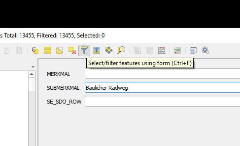

* Radwege sollten jetzt auf der Karte markiert sein (gelb).

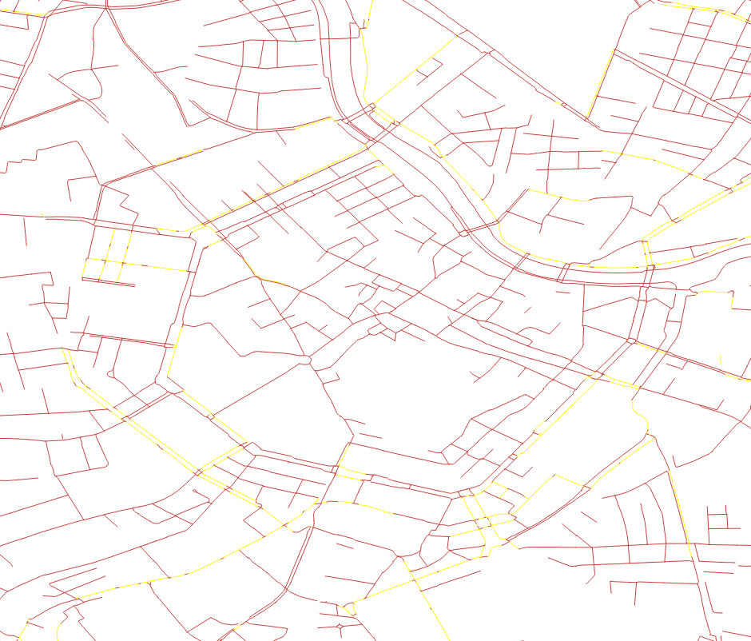

### Export "Baulicher Radweg" Features zu neuem Layer

* Rechtsklick auf vorhandenen layer, "save selected features as" auswählen.

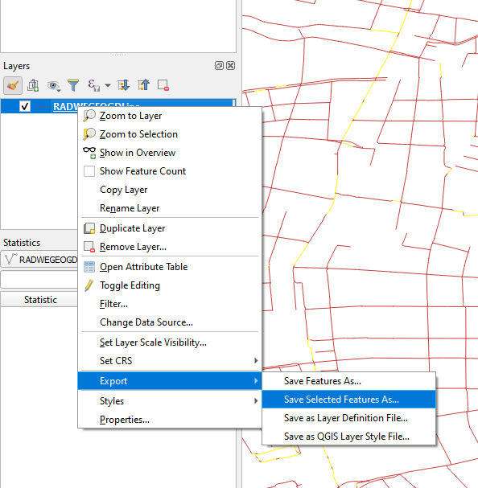

* Als Shapefile exportieren. Sicherstellen dass der Pfad gültig ist.

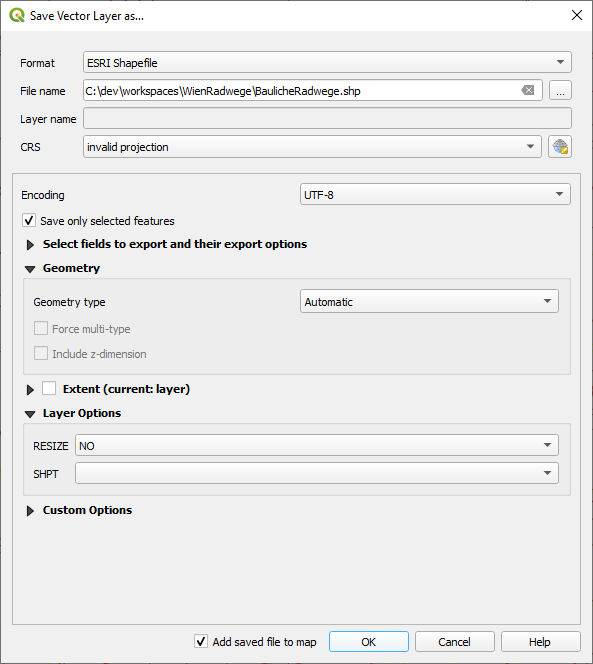

* Den originalen "RADWEGE.." Layer abschalten und nur noch die baulichen Radwege aktivieren.

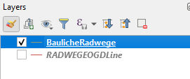

### Streckenlänge berechenn

* Mit der Methode von: https://www.qgistutorials.com/en/docs/calculating_line_lengths.html
* Rechtsklick auf den "BaulicheRadwege" Layer und "Open Attribute Table" wählen
* Dann "Toggle Editing Mode" (bleistift ganz links) aktivieren, und auf "Open field calculator" (Abakus symbol) klicken.

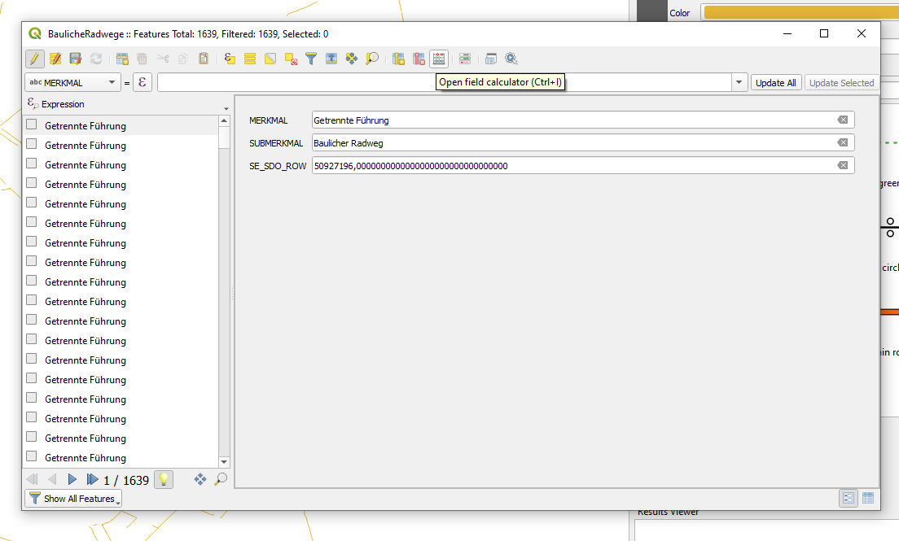

* Neues Feld "length" erstellen, mit decimal number type und der expression "$length / 1000". Damit wird für jede line deren Länge in Kilometer berechnet (Da die Einheit der Projektion des Projektes Meter sind). Mit "okay" bestätigen.

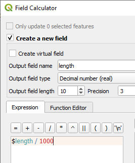

### Streckenlänge berechnen

* "Basic Statistics for Fields" tool auswählen

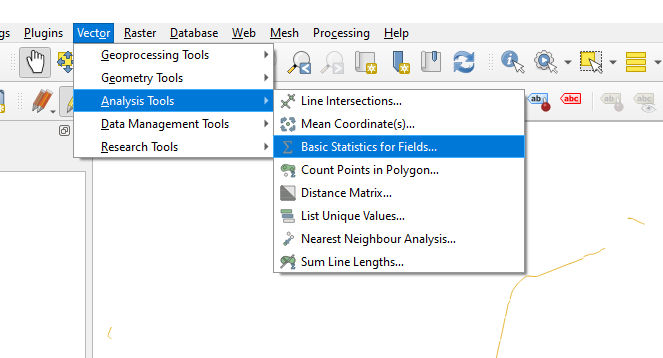

* "length" auswählen und "run" drücken.

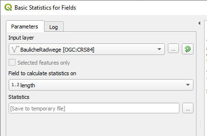

* Ergebnis: 172.7km baulich getrennte Radwege

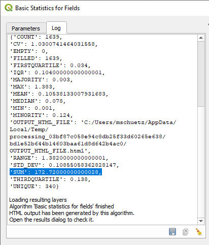

# Berechnen der Doppelseitigen Radwege

* Neuer Layer für doppelseitige Radwege erstellen und händisch lines nachziehen dort wo Radwege an beiden Strassenseiten sind.

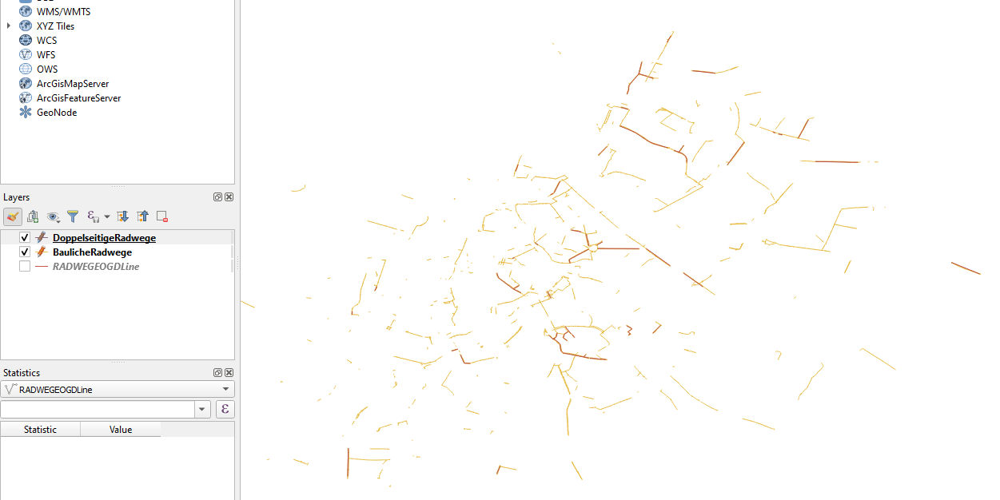
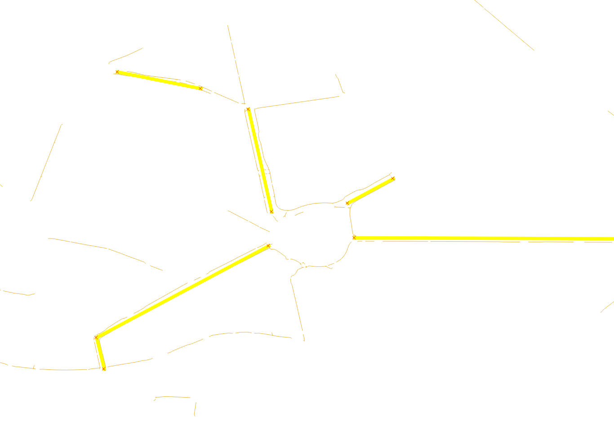

* Wie zuvor für jede line die Länge bestimmen und das Analyse Tool verwenden um die Gesamtlänge zu berechnen. Gesamtlänge der doppelseitig geführten Strassen: ca. 23.8km.

